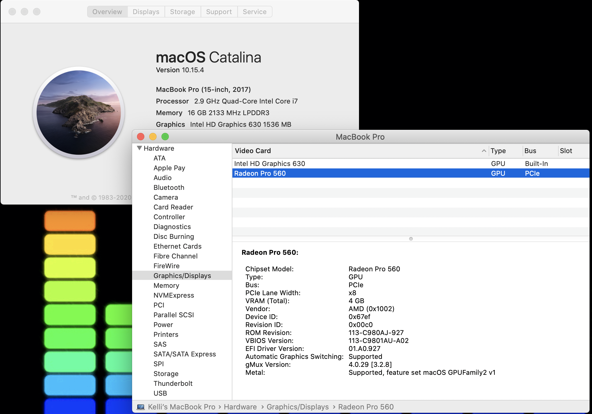
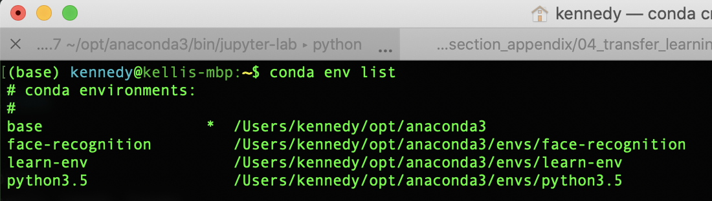
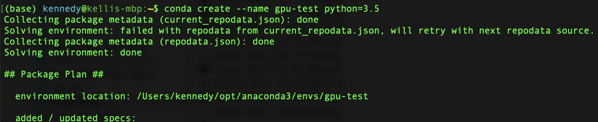
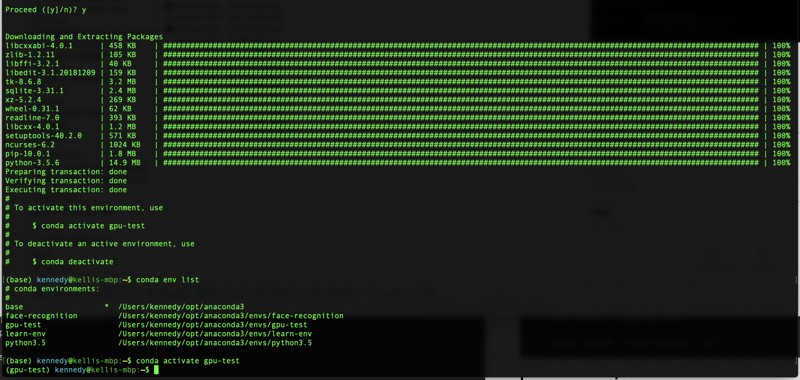

# Speed Up Model Training Using GPU
## Offload computation tasks to decrease train time

I have worked in the tech sector for over 20 yers.  During that time, I've worn numerous hats over numerous disciplines.  Recently, I decided to reboot my career from cloud infrastructure to data science.  As my journey progressed and I started working with more complex models, I became bothered by the constant waiting for my models to train, or worse hypertuning, (with GridsearchSV). <mark>rewrite this and the title for speeding up GridSearch</mark>

Most advertisements referencing GPUs (or math coprocessors if you've been around that long) center around gamers.  As the GPUs are for number crunching, I decided to see how to offload my cmputation intensive python functions to the GPU.

In researching, everything pouts to Nvidia and their Cuda Toolkit.  I was really disappointed to read that the toolkit was only for Nvidia GPU's.  I'm afraid my MacBook Pro doesn't fit that profile!  Regardless, I decided to give it the old 'college hack' to see if it would work.



First, I strongly suggest that you setup a seperate environment to test this.  The last thing you want to do is trash your development environment and then have to reinstall everything.  I prefer to use Anaconda, so follow along to setup from the command line.

Before beginning, I would recommend that you read all release notes, installation notes, etc from Nvidia's website.  I am not following the installation guide from NVIDIA's webste.  And for the record, my `AMD Radeon Pro 560` is _**not**_ on the list of supported GPUs.

## Virtual Environment  
First, let's check out our current conda environment and create the new environment for testing.  You may run these commands from a terminal window, or straight from a jupyter notebook.

    

As you can see, I have numerous environments already setup. I chose to install a new environment 'gpu-test' with python version 3.5.  I've had the least amount of package compatibility errors with 3.5.  

 

After some time, you will be presented with a list of packages that will be downloaded and installed.  Type `y` to continue.

  

Once the installation is complete, activate the new environment that you just created.  You should notice the promt change to `gpu-test` (or whatever you named your environment).

## Install Required Packages  
We will need to install [numba](http://numba.pydata.org/) in addition to NVIDIA's CUDA Toolkit.  Numba is an open source JIT compiler that will translate our python functions (or jupyter cells) into code that will run fast on the GPU. 

To simplify the install, I will not go to NVIDIA's site to download the software, I will use conda instead.  Execute the following commands from the command line, or a jupyter notebook cell.  Notice that we are also installing the required packages for our environment to run a GridSearch on a Random Forrest Classifier using scikit-learn's iris dataset.

````python
conda install -y numpy
conda install -y pandas
conda install -y scikit-learn
conda install -y numba
conda install -y cudatoolkit
# export the environment so that they can import it
````
